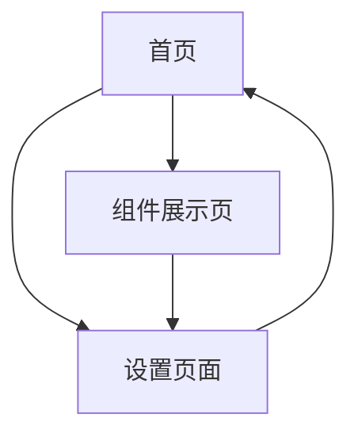

## 1. 产品概述
基于后端服务构建的Vue.js前端项目，采用极简主义设计风格和Glassmorphism视觉效果。通过动态毛玻璃效果和高斯模糊技术，为用户提供现代、优雅的交互体验。

目标用户为追求现代视觉体验的企业和个人开发者，产品价值在于提供高性能、美观且易用的前端界面解决方案。

## 2. 核心功能

### 2.1 用户角色
| 角色 | 注册方式 | 核心权限 |
|------|----------|----------|
| 普通用户 | 邮箱注册 | 浏览基础功能、使用界面组件 |
| 管理员 | 后台分配 | 管理界面配置、查看系统状态 |

### 2.2 功能模块
项目包含以下核心页面：
1. **首页**: 展示毛玻璃效果组件、导航菜单、功能概览
2. **组件展示页**: 动态模糊效果演示、交互组件库、实时预览
3. **设置页面**: 主题配置、模糊强度调节、性能优化选项

### 2.3 页面详情
| 页面名称 | 模块名称 | 功能描述 |
|-----------|-------------|-------------|
| 首页 | 英雄区域 | 展示动态毛玻璃背景效果，支持鼠标跟随模糊 |
| 首页 | 导航栏 | 半透明毛玻璃导航，平滑过渡动画 |
| 首页 | 功能卡片 | 高斯模糊卡片组件，悬停时增强效果 |
| 组件展示页 | 效果控制面板 | 实时调节模糊强度、透明度参数 |
| 组件展示页 | 组件库 | 展示各种毛玻璃效果的应用场景 |
| 组件展示页 | 实时预览 | 即时显示参数调整后的视觉效果 |
| 设置页面 | 主题配置 | 切换深浅主题，调节整体色调 |
| 设置页面 | 性能设置 | 控制动画帧率，优化渲染性能 |
| 设置页面 | 响应式测试 | 预览不同屏幕尺寸下的显示效果 |

## 3. 核心流程
用户操作流程：
1. 用户访问首页 → 体验基础毛玻璃效果 → 导航至组件展示页
2. 在组件展示页 → 调节模糊参数 → 实时预览效果 → 应用到项目
3. 在设置页面 → 配置主题偏好 → 优化性能设置 → 保存个人配置

## 4. 用户界面设计

### 4.1 设计风格
- **主色调**: 柔和中性色（#F8F9FA, #E9ECEF, #DEE2E6）
- **强调色**: 淡雅蓝色（#6C9BCF, #4C7CBF）
- **按钮样式**: 圆角矩形，半透明背景，悬停渐变
- **字体**: Inter字体族，标题24-32px，正文14-16px
- **布局**: 卡片式布局，网格系统，留白充足
- **图标风格**: 线性图标，简洁几何形状

### 4.2 页面设计概览
| 页面名称 | 模块名称 | UI元素 |
|-----------|-------------|-------------|
| 首页 | 英雄区域 | 全屏渐变背景，中心毛玻璃面板，模糊强度随鼠标移动变化 |
| 首页 | 导航栏 | 固定顶部，backdrop-filter模糊，透明度80%，平滑阴影 |
| 组件展示页 | 控制面板 | 滑块控制器，实时数值显示，预设效果按钮 |
| 设置页面 | 主题切换 | 圆形切换按钮，平滑过渡动画，状态指示器 |

### 4.3 响应式设计
- **桌面优先**: 1440px基准设计，支持最大1920px
- **平板适配**: 768px-1024px，栅格布局调整
- **移动端**: 320px-767px，单列布局，触摸优化
- **断点**: 320px, 768px, 1024px, 1440px

### 4.4 动画效果指导
- **过渡动画**: 所有交互元素使用ease-out缓动
- **模糊动画**: 60fps流畅度，避免性能抖动
- **加载动画**: 骨架屏配合渐进式模糊效果
- **交互动画**: 悬停状态150ms，点击反馈100ms