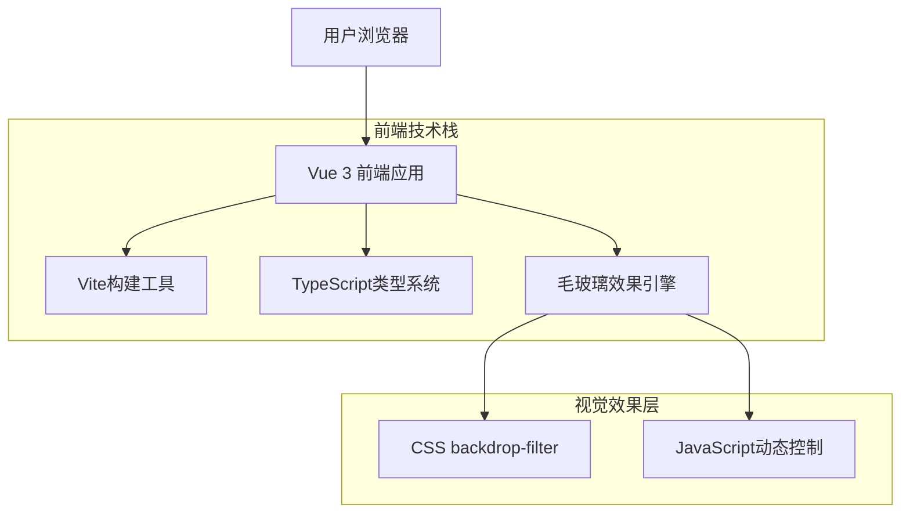
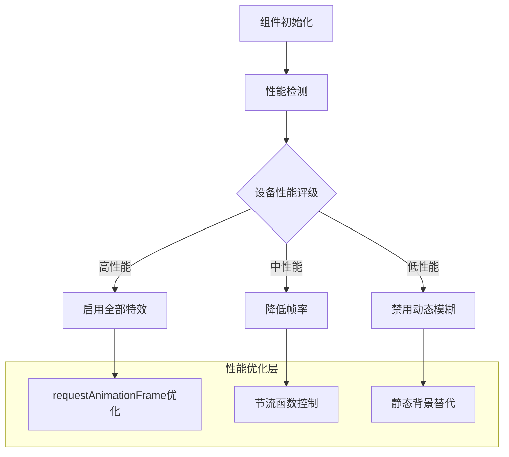

## 1. 架构设计



## 2. 技术栈描述

- **前端框架**: Vue 3@latest + Composition API
- **构建工具**: Vite@latest
- **样式方案**: TailwindCSS@3 + 自定义CSS变量
- **类型系统**: TypeScript@5
- **代码规范**: ESLint@8 + Prettier@3
- **测试框架**: Vitest@latest + @vue/test-utils@2
- **初始化工具**: vite-init

## 3. 路由定义

| 路由路径 | 页面用途 |
|----------|----------|
| / | 首页，展示基础毛玻璃效果和导航 |
| /components | 组件展示页，演示各种毛玻璃效果 |
| /settings | 设置页面，配置主题和性能选项 |
| /preview | 预览页面，全屏展示效果 |

## 4. 核心组件架构

### 4.1 毛玻璃效果组件
```typescript
interface GlassEffectProps {
  blurIntensity: number // 模糊强度 (0-20px)
  opacity: number // 透明度 (0-1)
  backgroundColor: string // 背景颜色
  borderRadius: string // 圆角大小
  transitionDuration: number // 过渡时间 (ms)
}

interface GlassCardEmits {
  'effect-change': [config: GlassEffectProps]
  'hover-start': []
  'hover-end': []
}
```

### 4.2 动态模糊控制器
```typescript
interface BlurControllerState {
  isRealTime: boolean // 是否实时更新
  frameRate: number // 帧率限制
  mouseTracking: boolean // 鼠标跟随
  performanceMode: 'high' | 'medium' | 'low' // 性能模式
}
```

### 4.3 响应式布局系统
```typescript
interface BreakpointConfig {
  mobile: '320px'
  tablet: '768px'
  desktop: '1024px'
  wide: '1440px'
}

interface ResponsiveState {
  currentBreakpoint: keyof BreakpointConfig
  isMobile: boolean
  isTablet: boolean
  isDesktop: boolean
}
```

## 5. 性能优化策略



## 6. 项目结构规范

```
front/
├── src/
│   ├── components/          # 通用组件
│   │   ├── GlassCard/      # 毛玻璃卡片组件
│   │   ├── BlurController/ # 模糊控制器
│   │   └── ResponsiveLayout/ # 响应式布局
│   ├── composables/        # 组合式函数
│   │   ├── useGlassEffect.ts # 毛玻璃效果逻辑
│   │   ├── usePerformance.ts # 性能优化
│   │   └── useResponsive.ts  # 响应式处理
│   ├── views/             # 页面组件
│   │   ├── HomeView.vue
│   │   ├── ComponentsView.vue
│   │   └── SettingsView.vue
│   ├── styles/            # 样式文件
│   │   ├── variables.css   # CSS变量
│   │   ├── glassmorphism.css # 毛玻璃效果
│   │   └── animations.css  # 动画定义
│   ├── utils/             # 工具函数
│   │   ├── performance.ts  # 性能检测
│   │   ├── blur.ts       # 模糊算法
│   │   └── browser.ts    # 浏览器兼容
│   └── types/             # TypeScript类型
│       ├── glass.d.ts     # 毛玻璃相关类型
│       └── component.d.ts # 组件类型定义
├── tests/                 # 测试文件
├── docs/                  # 组件文档
└── vite.config.ts        # Vite配置
```

## 7. 浏览器兼容性方案

### 7.1 backdrop-filter兼容性处理
```typescript
// 检测浏览器支持
export const checkBackdropFilterSupport = (): boolean => {
  const el = document.createElement('div')
  const style = el.style
  return 'backdropFilter' in style || 'webkitBackdropFilter' in style
}

// 降级方案
export const getFallbackStyle = (opacity: number) => {
  return {
    backgroundColor: `rgba(255, 255, 255, ${opacity * 0.8})`,
    boxShadow: '0 8px 32px rgba(0, 0, 0, 0.1)'
  }
}
```

### 7.2 性能监控
```typescript
interface PerformanceMetrics {
  fps: number
  renderTime: number
  memoryUsage: number
  deviceRating: 'high' | 'medium' | 'low'
}

export const monitorPerformance = (): PerformanceMetrics => {
  // 实现性能监控逻辑
}
```